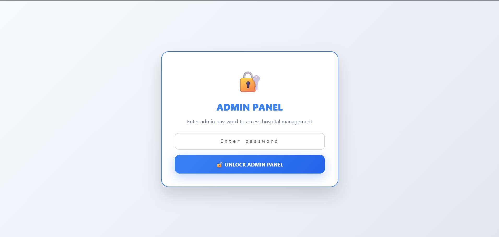
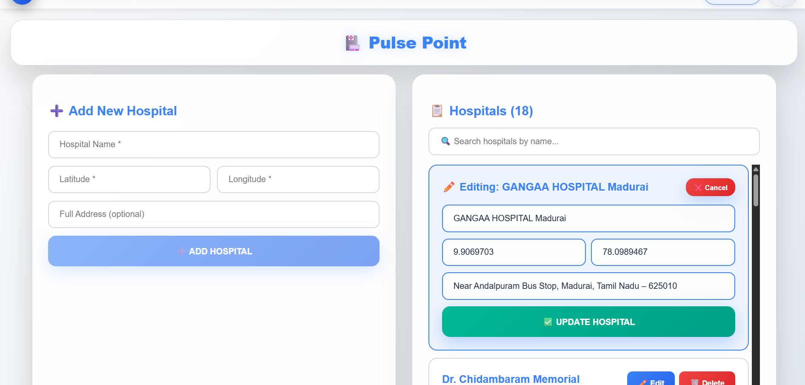
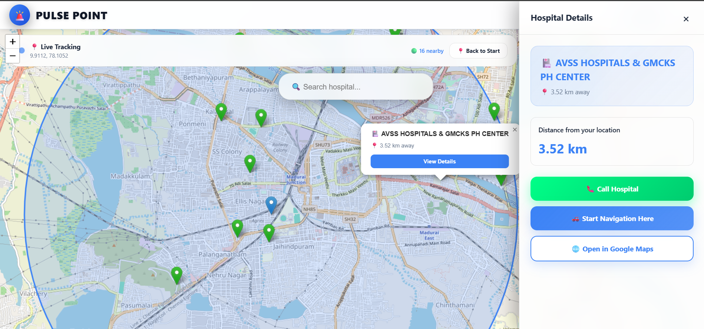
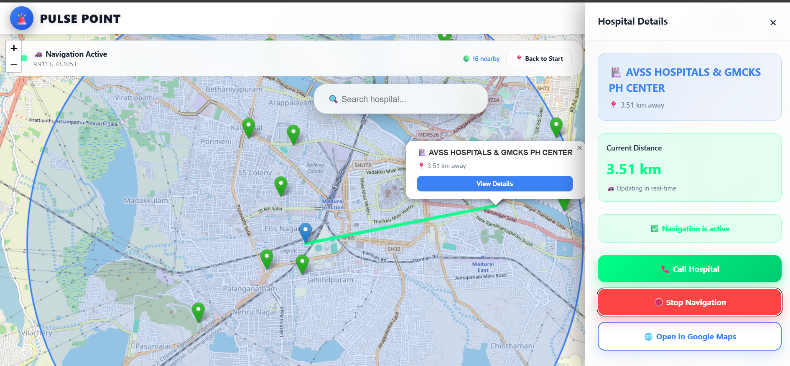

# 🏥 PulsePoint – Nearby Hospital Finder

PulsePoint is a full-stack Hospital Management web application developed using the **MERN stack**.  
It allows admins to manage hospital records efficiently and provides users with an interactive interface to view hospital details with real-time location tracking.

Live Demo: https://pulsepoint-tgrl.onrender.com/

---

## 🚀 Features

### 👤 User Features
- View hospital details
- Browse hospital listings
- View detailed hospital information in side panel
- Active navigation highlighting
- Light & Dark theme support
- Responsive design
- 📍 Live user location tracking
- 🟢 Green location pointers indicate hospitals within 5 km of the user's current location
- 🔴 Red location pointers indicate hospitals farther away from the user
- 🔎 Nearby hospital search based on user’s live location
- 🗺️ Option to navigate to hospital:
  - Track route inside PulsePoint
  - Or open directly in Google Maps for navigation (redirects to maps start page)

---

## 🧰 Tech Stack

### Frontend
- React
- Vite
- CSS

### Backend
- Node.js
- Express.js

### Database
- MongoDB

---

## 📸 Screenshots

### 🔐 Admin Login

### 🏠 Home Page (Light Theme)
.png)

### 🌙 Home Page (Dark Theme)
.png)

### 🛠️ Admin Panel (Light Theme)
.png)

### 🌙 Admin Panel (Dark Theme)
.png)

### ✏️ Edit Hospital Details

### 📋 Hospital Details Side Panel

### 🧭 Active Navigation

---
